# sequencer-svg

A standalone Node.js tool for building UML-style sequence diagrams from JSON, YAML, or Mermaid input and outputting SVG.


## Quick Start

The simplest way to use sequencer-svg is the opinionated mode — pass a single filename:

```bash
# From Mermaid
node sequencer.js diagram.mmd

# From YAML
node sequencer.js diagram.yaml

# From JSON
node sequencer.js diagram.json
```

This auto-detects the input format and writes all output artefacts (SVG, JSON, YAML) to the same directory.

## Installation

```bash
npm install
```

## Usage

### Opinionated Mode (Recommended)

Pass a single filename to auto-detect format and rebuild in place:

```bash
node sequencer.js diagram.mmd    # writes .sequencer.yaml, .json, .svg
node sequencer.js diagram.yaml   # writes .json, .svg, .yaml
node sequencer.js diagram.json   # writes .yaml, .svg, .json
```

### Standard Mode

For more control, use explicit flags:

```bash
# YAML input to SVG
node sequencer.js -y -i diagram.yaml -o -f

# JSON input to SVG
node sequencer.js -i diagram.json -o -f

# Mermaid input to SVG (also writes .sequencer.yaml sidecar)
node sequencer.js --mermaid -i diagram.mmd -o -f

# Mermaid transform only (no SVG)
node sequencer.js --mermaid --transformOnly -i diagram.mmd

# Write to specific directory
node sequencer.js -y -i diagram.yaml -o -f -t ./output

# Stdin to stdout
cat diagram.json | node sequencer.js > diagram.svg
```

### Command-Line Options

| Flag | Alias | Description |
|------|-------|-------------|
| `file` | (positional) | Input file — triggers opinionated mode with auto-detection |
| `-i` | `--inputFile` | Read input from file instead of stdin |
| `-o` | `--outputFile` | Write primary output to file (derives name if value omitted) |
| `-t` | `--targetDir` | Directory for output files |
| `-y` | `--yaml` | Treat input as YAML instead of JSON |
| `-m` | `--mermaid` | Treat input as Mermaid sequence-diagram syntax |
| `-T` | `--transformOnly` | Stop after writing transformed YAML (Mermaid only) |
| `-f` | `--force` | Overwrite existing output files |
| `-J` | `--outjson` | Also write formatted JSON file |
| `-Y` | `--outyaml` | Also write formatted YAML file |
| `-c` | `--nocovertext` | Skip title/version/description cover text |
| `-v` | `--verbose` | Emit debug messages to stderr |
| `-I` | `--id` | Correlation ID for verbose logs |
| `-?` | `--help` | Show help text |

---

## Document Format

Sequencer documents can be written in YAML or JSON. The structure is identical in both formats.

### Minimal Example

```yaml
title: Hello World
version: "1.0"
actors:
  - name: Alice
    alias: A
  - name: Bob
    alias: B
lines:
  - type: call
    from: A
    to: B
    text: Hello!
  - type: return
    from: B
    to: A
    text: Hi there!
```

**Rendered output:**


### Root Properties

| Property | Type | Required | Default | Description |
|----------|------|----------|---------|-------------|
| `title` | string | Yes | — | Document title rendered at the top of the diagram |
| `version` | string | Yes | — | Version string displayed below the title (e.g. "1.0", "2.1.3") |
| `description` | string or string[] | No | — | Description text rendered below the version; use an array for multiple lines |
| `actors` | array | Yes | — | Array of actor definition objects (see Actor Properties) |
| `actorGroups` | array | No | — | Array of actor group objects for visual groupings (see Actor Groups) |
| `lines` | array | Yes | — | Array of line objects defining messages, fragments, and spacing |
| `autonumber` | boolean | No | `false` | When `true`, prefixes each message with a sequential number; when `false`, no numbering |
| `params` | object | No | — | Document-wide styling defaults that apply to all elements unless overridden |

---

## Actors

Actors are the participants in your sequence diagram. They appear as boxes at the top and bottom of the diagram with a dashed timeline connecting them.

### Actor Definition

```yaml
actors:
  - name: User Interface
    alias: UI
    actorType: boundary
    bgColour: "rgb(200,220,255)"
    gapToNext: 200
    links:
      - label: Documentation
        url: https://example.com/docs
```

### Actor Properties

| Property | Type | Required | Default | Description |
|----------|------|----------|---------|-------------|
| `name` | string or string[] | Yes | — | Display name shown in the actor header; use an array for multiple lines |
| `alias` | string | Yes | — | Short identifier used to reference this actor in `from`/`to` fields |
| `actorType` | string | No | `"participant"` | Visual style of the actor header icon (see Actor Types below) |
| `gapToNext` | number | No | `150` | Horizontal gap in pixels between this actor and the next actor |
| `links` | array | No | — | Array of `{label, url}` objects rendered as clickable links below the actor |
| `bgColour` | colour | No | `"rgb(95,183,224)"` | Fill colour of the actor header box |
| `borderColour` | colour | No | `"rgb(0,0,0)"` | Stroke colour of the actor header box border |
| `fgColour` | colour | No | `"rgb(0,0,0)"` | Text colour of the actor name |
| `fontFamily` | string | No | `"sans-serif"` | Font family for the actor name text |
| `fontSizePx` | number | No | `18` | Font size in pixels for the actor name text |
| `radius` | number | No | `5` | Corner radius in pixels for the actor header box |

### Actor Types

The `actorType` property controls the visual representation of the actor header:

| Type | Description |
|------|-------------|
| `participant` | Standard rectangular box; the default when no type is specified |
| `actor` | Stick figure icon representing a human user or external agent |
| `boundary` | Circle with vertical line; represents a UI or external system interface |
| `control` | Circle with arrow; represents a controller or coordinator component |
| `entity` | Circle with horizontal underline; represents a data entity or domain model |
| `database` | Cylinder shape; represents a database or persistent storage |
| `collections` | Stacked rectangles; represents a collection, array, or set of items |
| `queue` | Rectangle with internal dividers; represents a message queue or buffer |

```yaml
actors:
  - {name: Caller Service, alias: Caller, actorType: participant}
  - {name: Human operator, alias: User, actorType: actor, bgColour: 'rgb(255,232,204)'}
  - {name: External boundary, alias: Edge, actorType: boundary, bgColour: 'rgb(196,232,255)'}
  - {name: Flow controller, alias: Control, actorType: control, bgColour: 'rgb(255,244,179)'}
  - {name: Order entity, alias: Entity, actorType: entity, bgColour: 'rgb(220,255,214)'}
  - {name: Database Layer, alias: DB, actorType: database, bgColour: 'rgb(255,221,234)'}
  - {name: Collections store, alias: Collections, actorType: collections, bgColour: 'rgb(226,220,255)'}
  - {name: Job queue, alias: Queue, actorType: queue, bgColour: 'rgb(255,235,186)'}
  - {name: API, alias: API, actorType: participant}
```

**Rendered output:**


### Actor Groups

Group actors visually with a labelled box.

#### Actor Group Properties

| Property | Type | Required | Default | Description |
|----------|------|----------|---------|-------------|
| `title` | string | No | `""` | Label displayed at the top of the group box; empty string shows no label |
| `bgColour` | colour | No | `"rgba(220,220,220,0.35)"` | Fill colour of the group box background |
| `actors` | string[] | One of | — | Explicit list of actor aliases to include in this group |
| `startActor` | string | One of | — | Alias of the first (leftmost) actor in a contiguous range |
| `endActor` | string | One of | — | Alias of the last (rightmost) actor in a contiguous range |

You must specify either `actors` (explicit list) or both `startActor` and `endActor` (contiguous range).

**Example using actor list:**

```yaml
actors:
  - {name: Caller, alias: Caller}
  - {name: Browser, alias: Browser}
  - {name: DB, alias: DB}
  - {name: Cache, alias: Cache}
  - {name: Service, alias: Service}
  - {name: Audit, alias: Audit}
actorGroups:
  - {title: Client tier, bgColour: Aqua, actors: [Caller, Browser]}
  - {title: Data tier, bgColour: 'rgba(255, 230, 200, 0.55)', actors: [DB, Cache]}
  - {title: Data tier, bgColour: 'rgba(255, 230, 200, 0.55)', actors: [Audit]}
```

**Example using start/end range:**

```yaml
actorGroups:
  - title: Client tier
    bgColour: Aqua
    startActor: Caller
    endActor: Browser
```

**Rendered output:**


---

## Line Types

The `lines` array contains the content of your diagram. Each line has a `type` that determines its behaviour.

### call — Standard Message

A solid arrow from one actor to another:

```yaml
- type: call
  from: A
  to: B
  text: Request data
```

#### Call Properties

| Property | Type | Required | Default | Description |
|----------|------|----------|---------|-------------|
| `from` | string | Yes | — | Alias of the source actor sending the message |
| `to` | string | Yes | — | Alias of the target actor receiving the message |
| `text` | string or string[] | Yes | — | Message label displayed on the arrow; use an array for multiple lines |
| `arrow` | string | No | `"fill"` | Arrow style at target end; shorthand for `toArrow` (see Arrow Styles below) |
| `fromArrow` | string | No | `"none"` | Arrow style at source end (see Arrow Styles below) |
| `toArrow` | string | No | `"fill"` | Arrow style at target end; if specified, overrides `arrow` |
| `fromAnchor` | string | No | `"edge"` | Where the line connects to the source: `"edge"` attaches at the activation bar edge, `"central"` attaches at the actor timeline centre |
| `toAnchor` | string | No | `"edge"` | Where the line connects to the target: `"edge"` attaches at the activation bar edge, `"central"` attaches at the actor timeline centre |
| `async` | boolean | No | `false` | When `true`, renders with open arrowhead and does not keep source active while awaiting response; when `false`, renders as synchronous call |
| `breakFromFlow` | boolean | No | `false` | When `true`, deactivates the source actor after sending this message; when `false`, source remains active |
| `breakToFlow` | boolean | No | `false` | When `true`, the target actor is not activated by this message; when `false`, target becomes active |
| `destroyFrom` | boolean | No | `false` | When `true`, terminates the source actor's lifecycle with an X marker; when `false`, source continues |
| `destroyTo` | boolean | No | `false` | When `true`, terminates the target actor's lifecycle with an X marker; when `false`, target continues |
| `comment` | object | No | — | Comment/note block attached to this message (see comment syntax) |

#### Arrow Styles

| Style | Description |
|-------|-------------|
| `fill` | Solid filled triangular arrowhead; typically indicates synchronous call |
| `open` | Open (unfilled) arrowhead; typically indicates asynchronous message |
| `cross` | X mark at the line end; indicates a lost or failed message |
| `empty` | Outlined triangular arrowhead with no fill |
| `none` | No arrowhead; just a plain line end |
| `halfTop` | Half arrowhead pointing upward from the line |
| `halfBottom` | Half arrowhead pointing downward from the line |

### return — Return Message

A dashed arrow typically representing a response:

```yaml
- type: return
  from: B
  to: A
  text: Response data
```

Return lines use the same properties as `call` but render with a dashed line.

### create — Actor Creation

A message that creates a new actor mid-sequence:

```yaml
- type: create
  from: Factory
  to: Instance
  text: new()
```

The target actor's header box appears at the point of creation rather than at the top.

### blank — Vertical Space

Add vertical spacing, optionally with activation changes or comments:

```yaml
# Simple spacing
- type: blank
  height: 20

# With activation
- type: blank
  height: 30
  activate: [A, B]
  deactivate: [C]

# With a note
- type: blank
  height: 40
  actor: A
  comment:
    text: This is a note
    bgColour: "rgb(255,255,200)"
```

#### Blank Properties

| Property | Type | Required | Default | Description |
|----------|------|----------|---------|-------------|
| `height` | number | Yes | — | Vertical space in pixels added to the diagram at this point |
| `actor` | string | No | — | Alias of the actor to anchor a comment to; comment appears beside this actor's timeline |
| `actors` | string[] | No | — | Array of two actor aliases; comment spans horizontally between these actors |
| `activate` | string[] | No | — | Array of actor aliases whose activation bars begin at this point |
| `deactivate` | string[] | No | — | Array of actor aliases whose activation bars end at this point |
| `comment` | object | No | — | Note/comment block to display; requires `actor` or `actors` to position it |

### fragment — Control Structure

Fragments represent control structures like loops, conditions, and parallel execution:

```yaml
- type: fragment
  fragmentType: loop
  title: Retry logic
  condition: while attempts < 3
  lines:
    - type: call
      from: Client
      to: Server
      text: retry()
```

#### Fragment Properties

| Property | Type | Required | Default | Description |
|----------|------|----------|---------|-------------|
| `fragmentType` | string | Yes | — | Type of fragment controlling its semantics and header label (see Fragment Types below) |
| `title` | string | Yes | — | Label displayed in the fragment header tab (e.g. "Retry logic") |
| `condition` | string | Yes | — | Condition text displayed in brackets below the title (e.g. "while x < 3"); use empty string if none |
| `lines` | array | Yes | — | Array of line objects contained within this fragment |
| `startActor` | string | No | — | Alias of the leftmost actor; if omitted, fragment spans all actors used within it |
| `endActor` | string | No | — | Alias of the rightmost actor; if omitted, fragment spans all actors used within it |
| `bgColour` | colour | No | `"rgb(255,255,255)"` | Fill colour of the fragment background |
| `borderColour` | colour | No | `"rgb(0,0,0)"` | Stroke colour of the fragment border |

#### Fragment Types

| Type | Description |
|------|-------------|
| `loop` | Iteration/repetition block; condition specifies the loop guard (e.g. "while x < 3") |
| `alt` | Alternative paths (if/else); use nested `condition` lines to define else branches |
| `opt` | Optional block; contents execute only if condition is met |
| `par` | Parallel execution; use nested `condition` lines with `and` to show concurrent paths |
| `critical` | Critical section; rendered with heavier border to indicate mutual exclusion |
| `break` | Break/exception handling; exits the enclosing fragment when condition is met |
| `rect` | Highlight region with coloured background; purely visual, no control-flow semantics |

**Example: Nested fragments with loop, alt, else, and opt:**


### condition — Fragment Divider

Divides a fragment into sections (e.g., else branches):

```yaml
- type: fragment
  fragmentType: alt
  title: Check result
  condition: success
  lines:
    - type: call
      from: A
      to: B
      text: process()
    - type: condition
      condition: failure
    - type: call
      from: A
      to: C
      text: handleError()
```

---

## Mermaid Support

sequencer-svg can transform Mermaid sequence diagram syntax into its native format.

### Basic Syntax

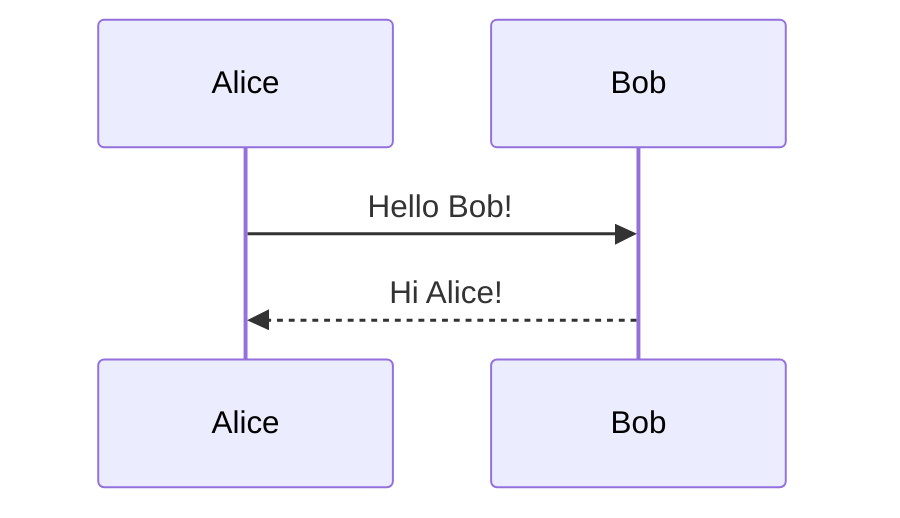

Transform with:

```bash
node sequencer.js diagram.mmd
```

### Supported Mermaid Features

#### Participants and Actors

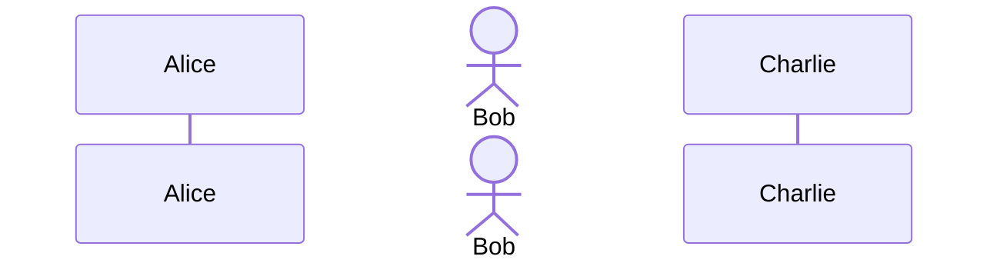

Actor types are preserved:

```mermaid
sequenceDiagram
    participant UI as User Interface
    boundary API as API Gateway
    control Svc as Service
    entity DB as Database
    database Cache as Redis
    collections Queue as Job Queue
```

**Rendered output showing all actor types:**


#### Messages and Arrows

| Mermaid | Description |
|---------|-------------|
| `A->B: text` | Solid line, no arrow |
| `A-->B: text` | Dashed line, no arrow |
| `A->>B: text` | Solid line, filled arrow (sync call) |
| `A-->>B: text` | Dashed line, filled arrow (return) |
| `A-xB: text` | Solid line, cross (lost message) |
| `A--xB: text` | Dashed line, cross |
| `A-)B: text` | Solid line, open arrow (async) |
| `A--)B: text` | Dashed line, open arrow |

**Rendered output showing arrow variants:**

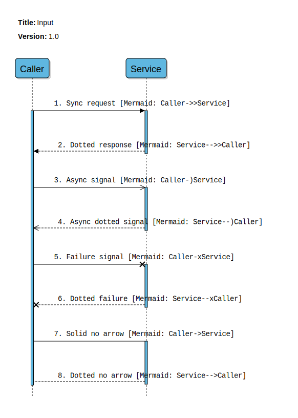

#### Activations

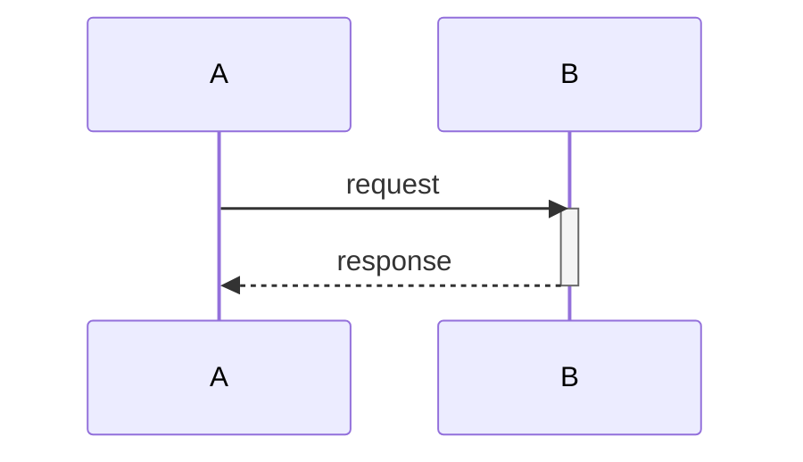

Or using `+` and `-` shortcuts:


**Rendered output showing activations:**

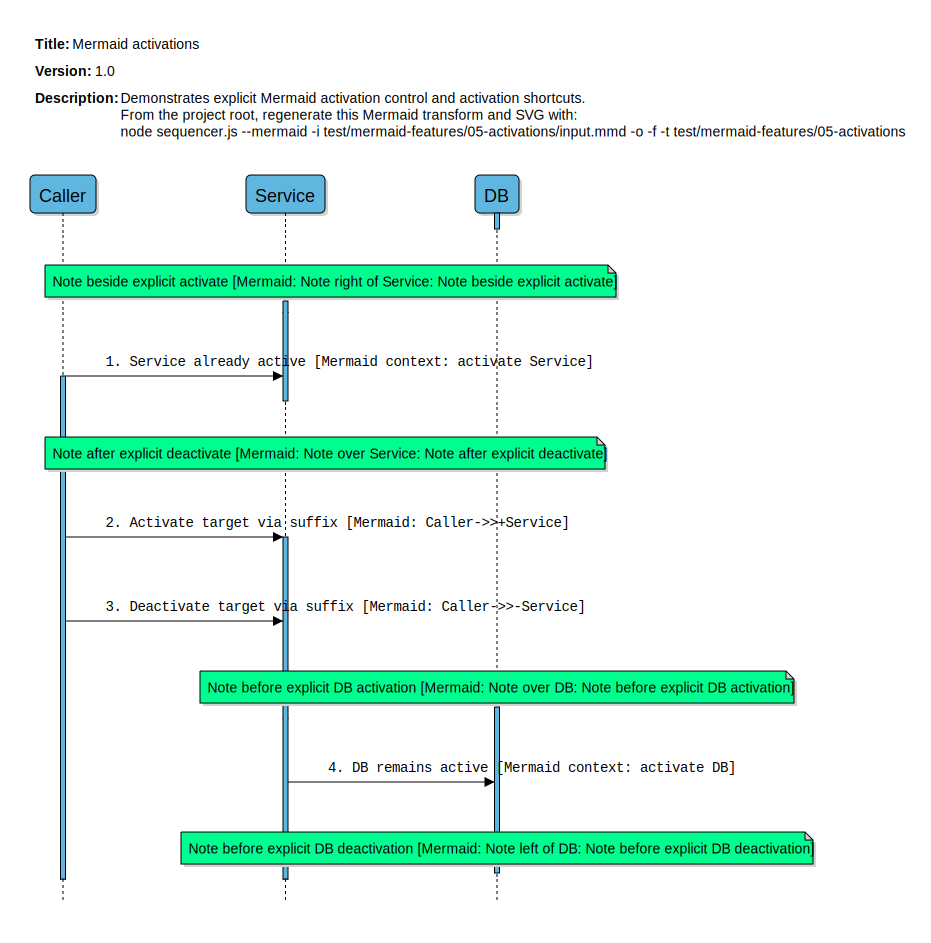

#### Notes

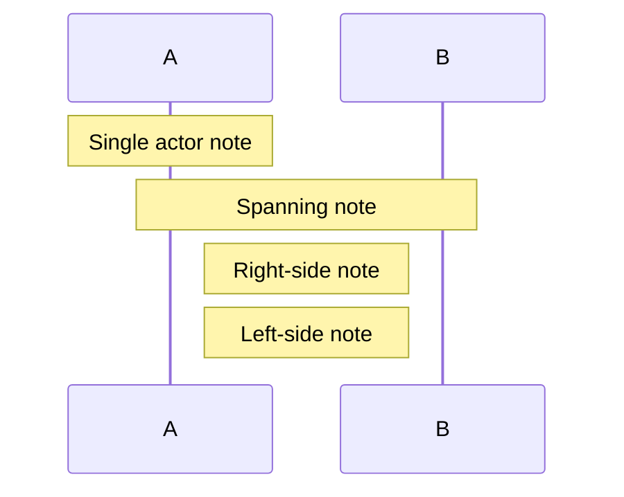

**Rendered output showing notes:**

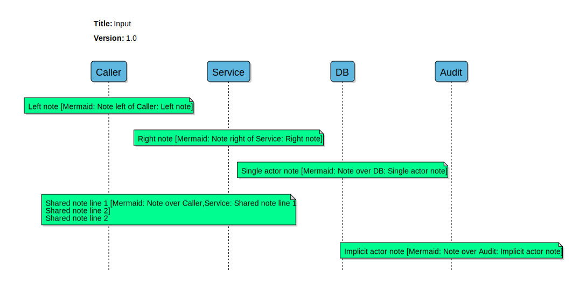

#### Fragments

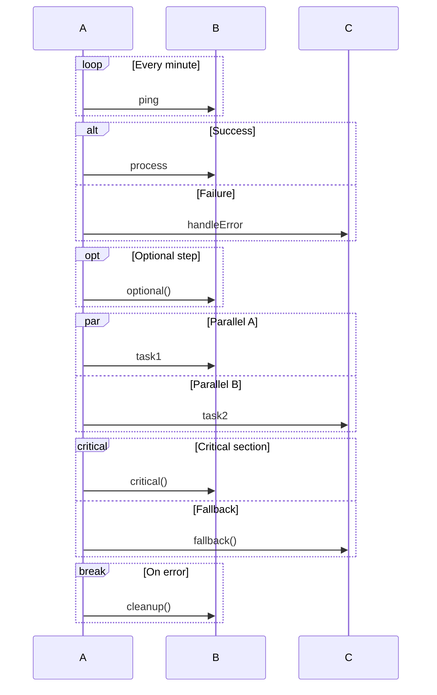

**Rendered output showing parallel execution:**

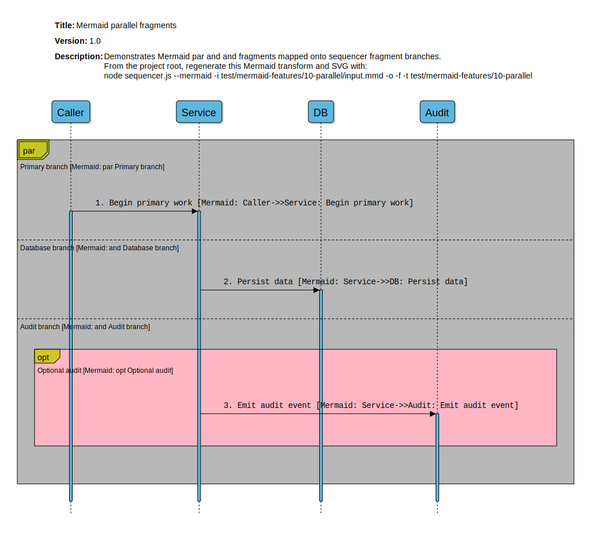

#### Rect Highlighting

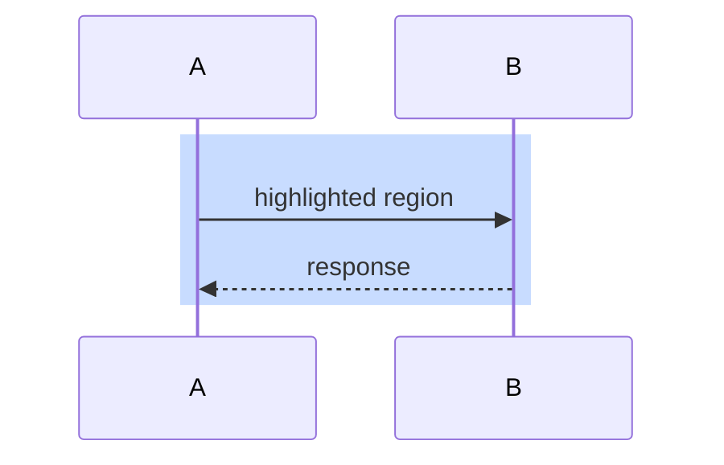

#### Create and Destroy

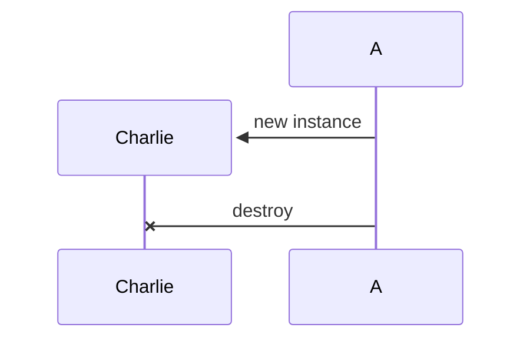

#### Autonumber

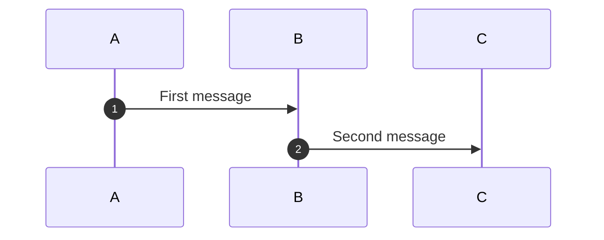

**Rendered output with autonumbering:**

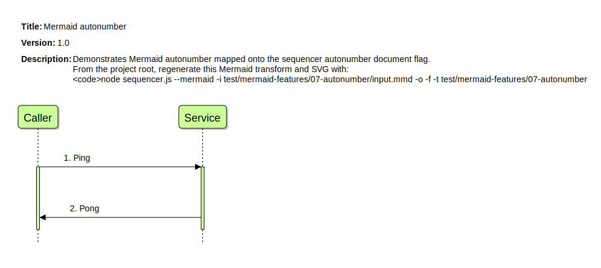

#### Actor Links

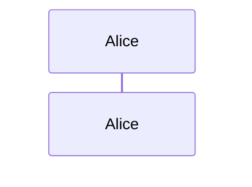

#### Accessibility

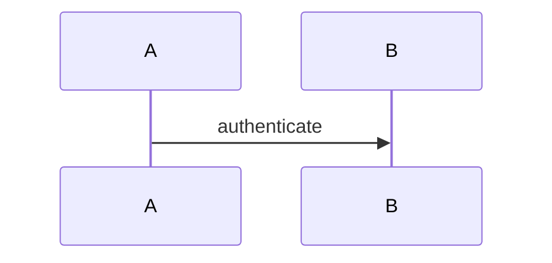

#### Box Grouping

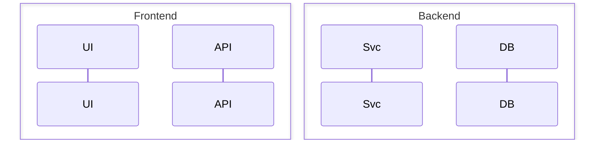

### Mermaid Colour Support

Colours can be specified in several places:

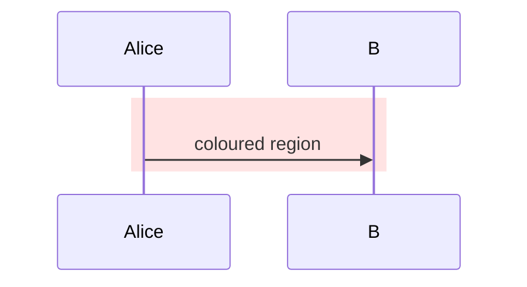

---

## Text Formatting

### Built-in Tags

The renderer supports built-in text markup tags:

| Tag | Effect |
|-----|--------|
| `<code>...</code>` | Blue monospace text |
| `<comment>...</comment>` | Dark italic text |
| `<emph>...</emph>` | Bold italic text |
| `<//>...<////>` | Dark italic with `// ` prefix |

Example:

```yaml
- type: call
  from: A
  to: B
  text: "Call <code>process()</code> method"
```

### Custom Tags

Define custom tags in the `params` section:

```yaml
params:
  tags:
    - "<warn>=<rgb(255,100,0)><b>"
    - "</warn>=</b></rgb>"
    - "<ok>=<rgb(0,150,0)>"
    - "</ok>=</rgb>"
```

### Inline Formatting

Within text values, you can use:

| Tag | Effect |
|-----|--------|
| `<b>`, `</b>` | Bold |
| `<i>`, `</i>` | Italic |
| `<rgb(r,g,b)>`, `</rgb>` | Text colour |
| `<px##>`, `</px>` | Font size |
| `<font=family>`, `</font>` | Font family |
| `<sz+>`, `<sz->` | Relative size adjustment |

---

## Styling

### Colour Formats

Colours can be specified as:

- **RGB**: `rgb(255, 128, 0)`
- **RGBA**: `rgba(255, 128, 0, 0.5)`
- **Hex**: `#FF8800` or `#F80`
- **Named**: `red`, `blue`, `lightgray`

### Dash Patterns

Line dashes are specified as arrays of on/off pixel values:

```yaml
borderDash: [4, 2]     # 4px on, 2px off
lineDash: [6, 3, 2, 3] # alternating pattern
```

An empty array `[]` means solid line.

### Document-Level Defaults

Use `params` to set defaults for the entire document:

```yaml
params:
  globalSpacing: 30
  comment:
    bgColour: "rgb(255,255,220)"
    spacing: 1.2
  fragment:
    borderColour: "rgb(100,100,100)"
```

---

## Error Handling

### Parse Errors

Invalid YAML or JSON syntax is reported to stderr and stops processing:

```
Error whilst parsing YAML: bad indentation at line 15
```

### Semantic Errors

If the document structure is valid but contains semantic errors (unknown actors, invalid types, etc.), the renderer:

1. Continues processing
2. Renders red error boxes in the SVG at the error location
3. Logs warnings to stderr with source-line numbers

Example error box content:

```
Error: Unknown actor alias "X" at line 23
```

**Example showing rendered error boxes:**


---

## Examples

### Generating Examples

```bash
npm run examples
```

This generates SVG outputs in `examples/` from the checked-in YAML files.

### Running Tests

```bash
npm test
```

This runs the Mermaid feature-slice Jest tests.

### Example Files

| File | Description |
|------|-------------|
| `examples/Example_1.1.0.yaml` | Basic sequence with styling |
| `examples/Example_2.1.0.yaml` | Custom tag overrides |
| `examples/Example_3.1.1.yaml` | Fragment nesting |
| `examples/Example_4.1.0.yaml` | Advanced arrows and flow |
| `examples/Example_5.1.0.yaml` | Error rendering demonstration |
| `test/mermaid-features/*/` | Mermaid feature test fixtures |

---

## Development Notes

This codebase preserves much of the original drawing model using a Canvas-like shim in `SvgContext.js`. This keeps rendering logic close to the original while producing SVG output.

### Repository Structure

```
sequencer.js          CLI entrypoint
SvgStart.js           Render initialisation
SvgContext.js         Canvas-like drawing API
SvgBuilder.js         SVG serialisation
FontManager.js        Text measurement
Actor.js              Actor rendering
Fragment.js           Fragment rendering
Call.js               Message rendering
Blank.js              Spacing and notes
schema.js             Document validation
MermaidSequenceTransformer.js   Mermaid parser
fonts/                Bundled Liberation fonts
examples/             Example documents
test/                 Jest test suites
```

### Fonts

The project bundles Liberation fonts for consistent text measurement. Font files are in `fonts/` and registered in `fonts.js`.

---

## Licence

Licensed under AGPL-3.0-only. See [LICENSE](./LICENSE).
